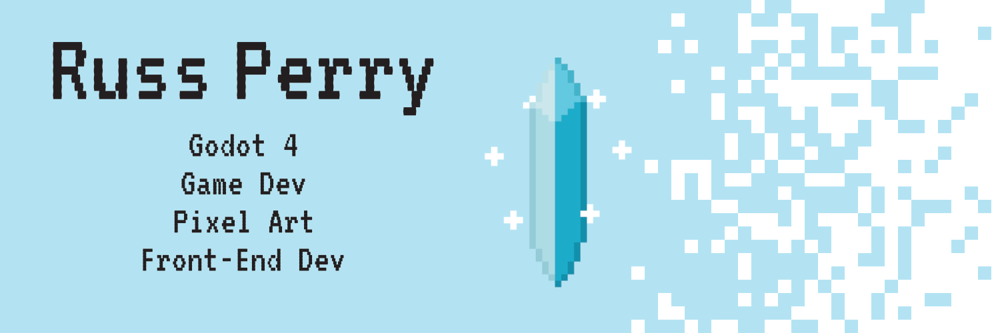
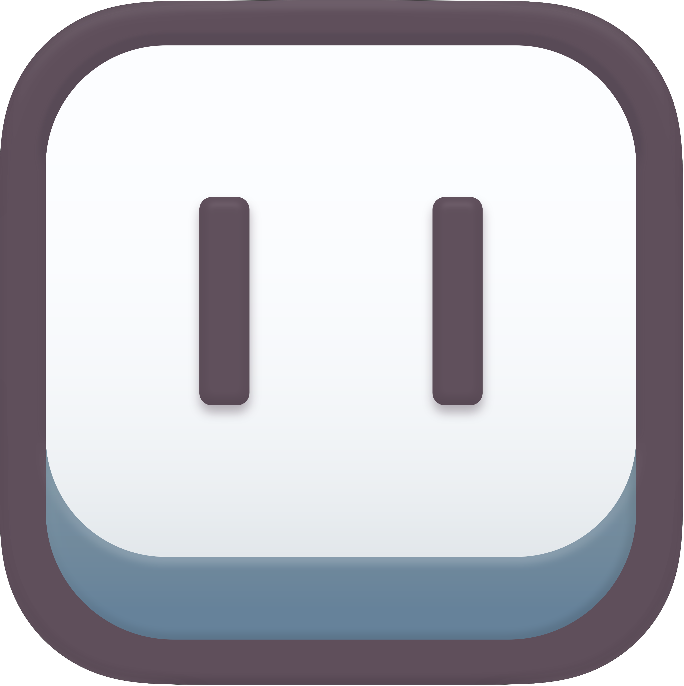
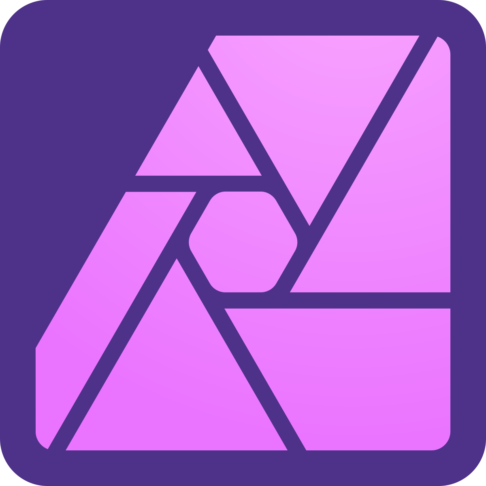

## 🎮 Russ Perry
Hello! I'm Russ, a game developer and front-end developer.

## What am I doing?
- Game Developement in Godot 4.
  - Currently working on the basics of Godot using a video series on making a Vampire Survivors clone. Check out my progress [here](https://github.com/rperry99/Vampire_Survivors_Clone)
- Diving into pixel art, taking on some challenges.
  - Going through [Saultoon's 2020 SeptemBIT Challenge](https://www.youtube.com/watch?v=11mBKkltki8) making one pixel art piece a day.
- Learning how to draw using [Drawabox](https://drawabox.com)

## Tool Stack

### Front-End Tools

 

### Game Dev Tools

 

### General Tech Tools

 

### Design Tools

 

### Project Management

 
 

## What I'm listening to

  

## What games am I playing?

  
  
  
  
  

<!-- ## What am I currently reading?

  <a href="https://www.amazon.com/Feel-Good-Productivity-More-What-Matters-ebook/dp/B0BQGKNHW1/ref=sr_1_1?dib=eyJ2IjoiMSJ9.ZMcD8zd6uNjDpJu7Fj7KSeeobn6et3Wnro2WoyoaP_T9_DlEkk1hcerAuItQWShgFprKX8r0pqs2BTO-g_SdQ0eTviCD2wni6bT3RyOcDlSv3PDT15PG8ilMIdsi33flVCVhPAI2WG49U2MbSYOW-vKbw_rXfPfzPm7qSZIpd0OQRUqrWGWfeJhJfHz3PniDZyixmBSwUvClIvP2XHdr0yl5dpKmHYuPkdjFlQszvvY.WsGtV3tyh1ly3TEeKQLA2CUj8dt_wG81gn6a744T8ks&dib_tag=se&hvadid=667401388767&hvdev=c&hvlocphy=9015298&hvnetw=g&hvqmt=e&hvrand=5890703491856110295&hvtargid=kwd-2173111892563&hydadcr=15554_13558538&keywords=feel+good+productivity+ali+abdaal&qid=1709325306&sr=8-1">
    
  </a>

 -->

<!-- ## I got some badges!

  

 -->

<!-- If you are interested in adding this to this your profile, check out this repo: https://github.com/novatorem/novatorem -->

<!--
**rperry99/rperry99** is a ✨ _special_ ✨ repository because its `README.md` (this file) appears on your GitHub profile.

Here are some ideas to get you started:

- 👯 I’m looking to collaborate on ...
- 🤔 I’m looking for help with ...
- 💬 Ask me about ...
- 📫 How to reach me: ...
- 😄 Pronouns: ...
- ⚡ Fun fact: ...
-->
