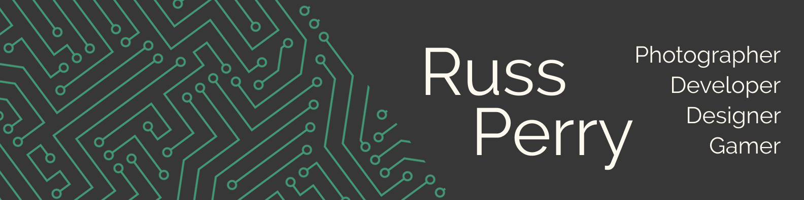

## 🎮 Russ Perry
Hey there! I'm Russ, a software development enthusiast with a keen eye for JavaScript and a flair for C# and Python. My heart beats for crafting exceptional code and bringing ideas to life through the power of technology.

When I'm not diving into the world of coding, you'll likely find me indulging in a few rounds of video games, capturing life's moments through the lens of my camera, or navigating tranquil waters with my trusty kayak. These hobbies fuel my creativity, sharpen my focus, and remind me that life is a beautiful balance of work and play.

With an unwavering passion for programming and a love for adventure, I'm on the lookout for exciting opportunities in the software development realm. Let's connect and explore the endless possibilities together! 🚀🎮📸🚣‍♂️

## What's Going on?
- 💻 Building captivating Front End experiences with Code, UI/UX design, Figma, and best practices.
- 🔐 Exploring Python and delving into game development with C#.
- 📸 Capturing the world's beauty on land and from my kayak through photography.
- 🎮 Currently immersed in Diablo IV, saving Sanctuary and conquering challenges!

## Languages and Tools

💻 Code

 

 

🖌 Design

 

 

📋 Project Management

 

 

💿 OS

 

## What I'm listening to

  

<!-- If you are interested in adding this to this your profile, check out this repo: https://github.com/novatorem/novatorem -->

## My Streaks

  

<!--
**rperry99/rperry99** is a ✨ _special_ ✨ repository because its `README.md` (this file) appears on your GitHub profile.

Here are some ideas to get you started:

- 👯 I’m looking to collaborate on ...
- 🤔 I’m looking for help with ...
- 💬 Ask me about ...
- 📫 How to reach me: ...
- 😄 Pronouns: ...
- ⚡ Fun fact: ...
-->
