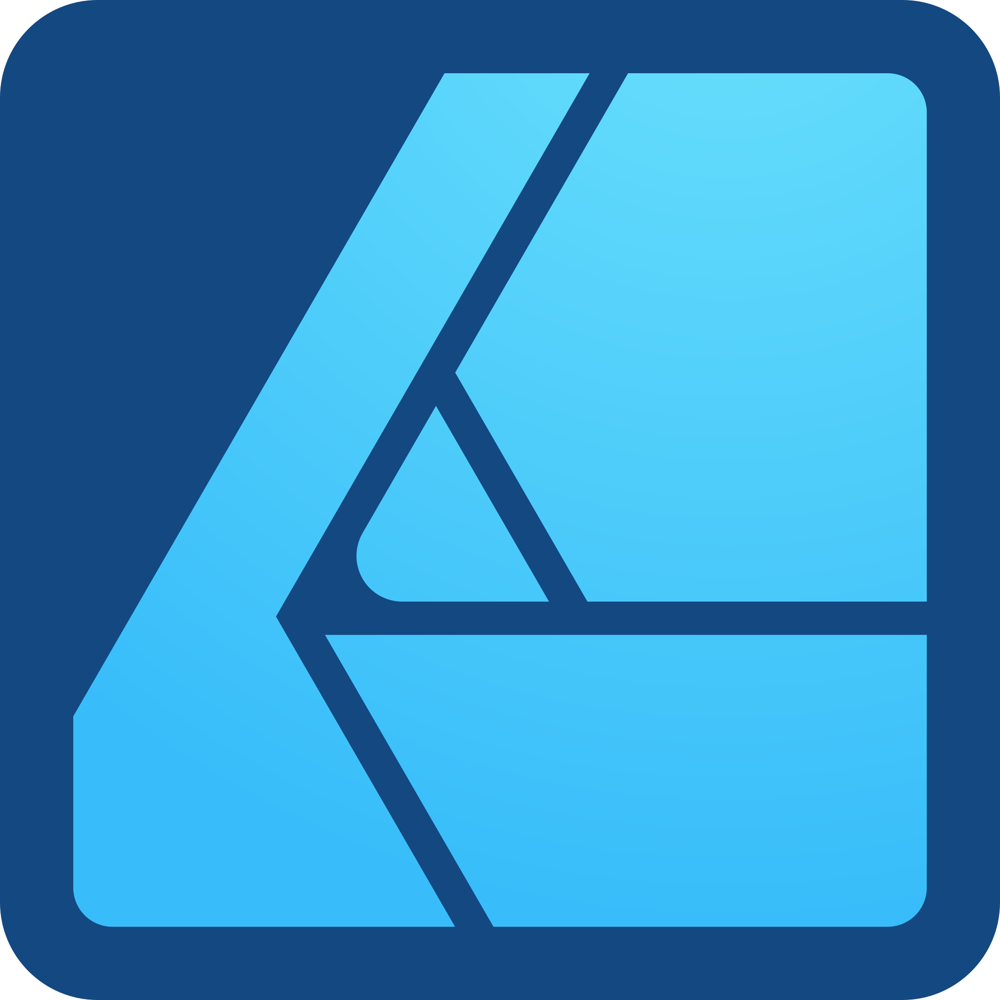

## Russ Perry

**Front-End Developer | Designer | Photographer**  
*Building clean websites, sharp interfaces, and the occasional side project.*

<!--  -->
<!--  -->

 
 
 

## What I'm Working On
- Building and refining [russperry.dev](https://russperry.dev) -- my portfolio / personal website
- Designing clean, modern portfolio projects
- Expanding my UX, accessibility, and visual design skills
- Exploring digital illustration

 
 

## Tools Of The Trade

### Front-End

 

### Design & Visuals

 

### General Tech Tools

 
 
 

## Workshop Projects
| Project Idea | Description |
|--------|----------|
| `russperry.dev` | Portfolio website for my current work. |
| `Cryptid Log` | A spooky-themed web app for tracking strange sightings (basically a note taking app) |
| `Birthday Tracker` | A web app where you can enter birthdays and it will tell you which birthdays are coming up. |

 
 

## What Inspires Me
- Thoughtful UX that feels invisible
- Interfaces that feel handcrafted, not templated
- Custom typefaces and expressive typography
- Design systems with soul
- Microinteractions that make products feel alive

 
 

## Role Models

- [Peter McKinnon](https://www.instagram.com/petermckinnon) - photographer with an inspiring aesthetic
- [Chris Piascik](https://www.instagram.com/chrispiascik/) – vibrant chaos meets illustrative lettering
- [The Good Chad](https://www.instagram.com/thegoodchad/) – expressive hand lettering with raw character
- [Will Paterson](https://www.youtube.com/@willpatersondesign) – professional logo design and typography
- [Jesse Showalter](https://www.youtube.com/@designchampions) – clean UX/UI meets strong brand building

 
 

## 🥃 Just For Fun
- Most likely to choose a typeface based on its name.
- Probably organizing something in Notion instead of actually doing it.
- Would 100% explore a haunted lighthouse.
- Listens to metal to relax.
- Once made a spreadsheet to track horror movies.
- Probably overthinking this README right now.

 
 

---

<em>Pixel perfection, on the rocks.</em>

